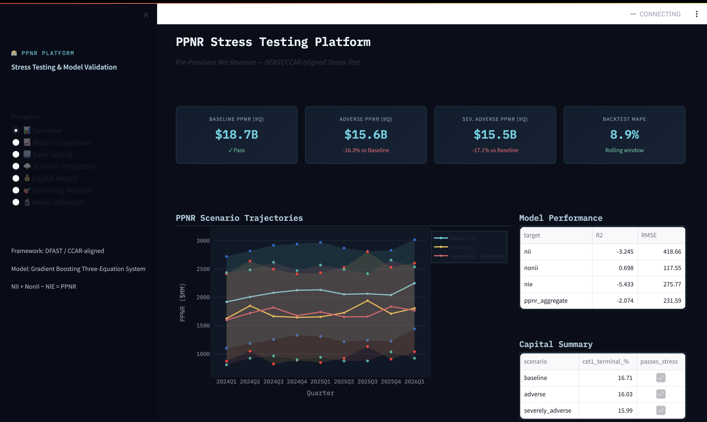

# PPNR Stress Testing & Model Validation Platform

**A DFAST/CCAR-aligned Pre-Provision Net Revenue stress testing framework**  
Built to demonstrate quantitative model development, validation, and stress scenario analysis for bank regulatory capital planning.

---

## Dashboard Preview



---

## Project Overview

This project implements an end-to-end PPNR (Pre-Provision Net Revenue) stress testing system aligned with the Federal Reserve's DFAST and CCAR regulatory frameworks. It covers the full model lifecycle: data engineering, econometric and machine learning model development, back-testing, scenario analysis, capital impact quantification, and model validation diagnostics.

**PPNR = Net Interest Income + Non-Interest Income − Non-Interest Expense**

---

## Results

### Model Performance (Test Set)
| Component | R² | RMSE |
|-----------|-----|------|
| Non-Interest Income | 0.698 | 117.55 |
| Net Interest Income | -3.245 | 418.66 |
| Non-Interest Expense | -5.433 | 275.77 |
| PPNR Aggregate | -2.074 | 231.59 |

### Stress Scenario Projections (9-Quarter Horizon)
| Scenario | Cumulative PPNR | vs Baseline |
|----------|----------------|-------------|
| Baseline | $18.7B | — |
| Adverse | $15.6B | -16.3% |
| Severely Adverse | $15.5B | -17.1% |

### Capital Adequacy (CET1 Ratio)
| Scenario | Terminal CET1 | Passes Stress? |
|----------|--------------|----------------|
| Baseline | 16.71% | ✅ |
| Adverse | 16.03% | ✅ |
| Severely Adverse | 15.99% | ✅ |

### Back-Test Performance
- **MAPE:** 8.9%
- **Directional Accuracy:** 47.6%
- **RMSE:** $210MM

### Key Findings
- Fed funds rate (lagged) is the dominant NII driver
- VIX and GDP growth are the strongest PPNR sensitivity factors
- All scenarios maintain CET1 well above the 7.0% regulatory minimum
- No structural breaks detected across any model component

---

## Skills Demonstrated

| Skill | Implementation |
|-------|---------------|
| Econometric modeling | OLS, Ridge, Lasso, ElasticNet regression |
| Machine learning | Random Forest, Gradient Boosting (ensemble) |
| Feature engineering | Lags, rolling means, interaction terms, differencing |
| Data wrangling | Winsorization, temporal train/test split, scaling |
| Stress testing | Baseline / Adverse / Severely Adverse scenario projection |
| Back-testing | Rolling-window expanding forecast with MAPE/RMSE/directional accuracy |
| Model validation | Durbin-Watson, Ljung-Box Q, Jarque-Bera, Breusch-Pagan, Chow test |
| Capital analysis | CET1 ratio impact, buffer vs. regulatory minimum |
| Sensitivity analysis | Partial derivative / finite-difference macro elasticities |
| Confidence intervals | Parametric bootstrap (1,000 replications, 90% CI) |
| Visualization | Interactive Streamlit dashboard with Plotly charts |
| Programming | Python, pandas, NumPy, scikit-learn, SciPy, Plotly, Streamlit |

---

## Project Structure

```
ppnr_stress_test/
├── utils/
│   └── data_generator.py       # Macro scenario & bank P&L data generation
│                                # DataWrangler: feature engineering, winsorization,
│                                # temporal splitting, standardization
│
├── models/
│   ├── ppnr_models.py          # PPNRModel base class (6 models + ensemble)
│   │                            # PPNRThreeEquationSystem (NII + NonII - NIE)
│   │                            # BackTestEngine (rolling window)
│   │
│   └── stress_engine.py        # StressProjectionEngine (point est. + bootstrap CI)
│                                # CapitalImpactAnalyzer (CET1 ratio projections)
│                                # SensitivityAnalyzer (finite-difference elasticities)
│                                # ModelValidationSuite (SR 11-7 diagnostics)
│
├── dashboard/
│   └── app.py                  # Interactive Streamlit dashboard (7 pages)
│
├── outputs/                    # Generated CSVs from pipeline
│   ├── 01_historical_data_with_features.csv
│   ├── 02_model_comparison.csv
│   ├── 03_three_equation_metrics.csv
│   ├── 03b_feature_importances.csv
│   ├── 04_backtest_results.csv
│   ├── 04_backtest_summary.csv
│   ├── 05a_macro_scenarios.csv
│   ├── 05b_stress_projections.csv
│   ├── 06_capital_impact.csv
│   ├── 07_sensitivity_analysis.csv
│   ├── 08_model_validation_diagnostics.csv
│   └── 09_executive_summary.csv
│
├── main_pipeline.py            # End-to-end pipeline orchestrator
├── requirements.txt
└── dashboard_screenshot.png
```

---

## Quick Start

### 1. Install dependencies
```bash
pip install -r requirements.txt
```

### 2. Run the full pipeline
```bash
python main_pipeline.py
```
This runs all 9 steps and exports results to `outputs/`.

### 3. Launch the dashboard
```bash
streamlit run dashboard/app.py
```

---

## Pipeline Steps

| Step | Description | Output |
|------|-------------|--------|
| 1 | Historical bank data generation + 27-feature engineering | `01_historical_data_with_features.csv` |
| 2 | Train & compare 6 models (OLS → GradientBoosting) | `02_model_comparison.csv` |
| 3 | Three-equation PPNR system (NII + NonII − NIE) | `03_three_equation_metrics.csv` |
| 4 | Rolling-window back-test (expanding window) | `04_backtest_results.csv` |
| 5 | Stress scenario projections + 90% bootstrap CI | `05b_stress_projections.csv` |
| 6 | CET1 capital impact by scenario | `06_capital_impact.csv` |
| 7 | PPNR sensitivity to 1-unit macro shocks | `07_sensitivity_analysis.csv` |
| 8 | Model validation diagnostics (SR 11-7) | `08_model_validation_diagnostics.csv` |
| 9 | Executive summary | `09_executive_summary.csv` |

---

## Regulatory Context

This framework is designed around the Federal Reserve's supervisory stress testing requirements:

- **DFAST (Dodd-Frank Act Stress Test)**: Annual supervisory stress test for banks > $100B
- **CCAR (Comprehensive Capital Analysis and Review)**: Fed's evaluation of capital adequacy and planning
- **SR 11-7**: Federal Reserve guidance on model risk management — defines standards for model development, implementation, and validation
- **Three scenarios**: Baseline, Adverse, and Severely Adverse (9-quarter horizon)

---

## Model Design Highlights

### Feature Engineering (27 features from 5 macro variables)
- Contemporaneous values: `gdp_growth`, `unemployment`, `hpi_growth`, `fed_funds_rate`, `vix`
- Lag-1 and Lag-2 for each variable (capture delayed transmission)
- Quarter-over-quarter changes (momentum)
- 4-quarter rolling mean (trend)
- Interaction terms: `rate × unemployment`, `gdp × hpi`

### Three-Equation Architecture
Modeling NII, NonII, and NIE separately (rather than PPNR directly) provides:
- Component-level interpretability required by regulators
- Ability to stress individual P&L lines
- Better model fit (each component has distinct macro drivers)

### Model Validation (SR 11-7 aligned)
Five statistical tests per component:
1. **Durbin-Watson** — residual serial correlation
2. **Ljung-Box Q (4-lag)** — higher-order autocorrelation
3. **Jarque-Bera** — residual normality
4. **Breusch-Pagan** — heteroskedasticity
5. **Chow Test** — structural break detection

---

## Author Notes

- Synthetic data is used throughout; no proprietary bank data is required
- All model parameters, correlations, and relationships are designed to mimic real-world behavior based on published academic and regulatory literature
- The framework is designed to be extensible — additional models, features, or components can be added via the existing base classes
